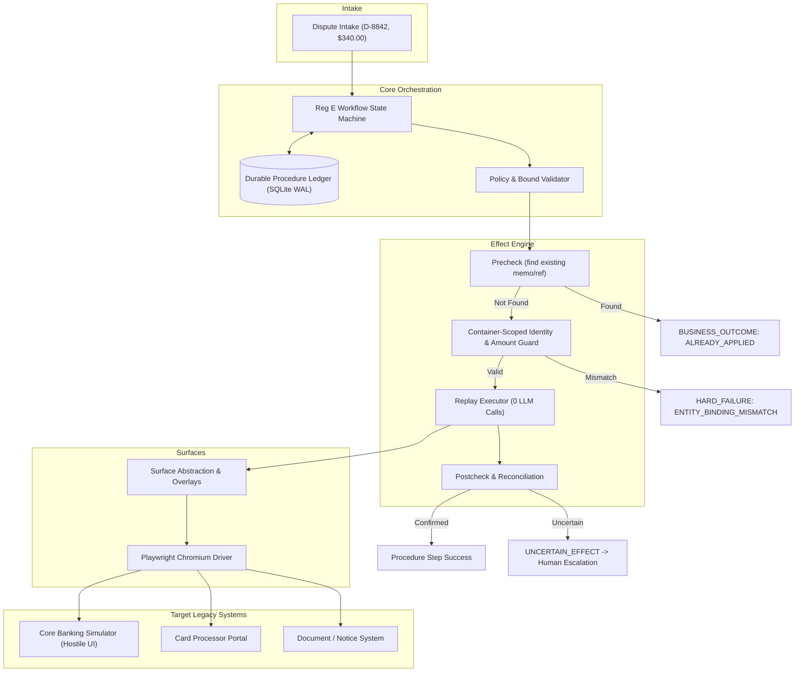

# Tandem

> **Effect-aware computer-use automation for legacy financial workflows.**

Tandem bridges the gap between conversational AI agents and disconnected legacy financial consoles. It ensures that when browser automation moves money or initiates regulatory procedures, replay guarantees **effects**, not merely browser clicks.

---

## The Problem

At roughly a hundred US community banks and credit unions, AI agents (voice and chat) capture member disputes. But completing the job requires navigating four legacy vendor consoles (core banking platforms, card processor portals, case trackers, document systems) that expose no APIs to each other.

When automated computer-use agents drive these consoles:
> **"The money moved. The procedure didn't finish."**

A browser automation may successfully post provisional credit to a member's account, then crash or disconnect before sending the required regulatory disclosure. Naive re-execution from the top risks crediting the member a second time, while doing nothing leaves the bank in violation of federal compliance deadlines.

---

## Why Ordinary Replay Is Unsafe

Standard record-and-replay systems verify that a DOM control was actuated and a page loaded. In financial operations, this allows three critical failures to pass undetected:

1. **Double Application:** A procedure fails mid-run and retries from step 1. Provisional credit is posted twice, paying the member duplicate funds.
2. **Wrong Entity:** Fuzzy search returns `8830142` and `8830124` in non-deterministic row order. A naive page-level assertion (`"8830142 appears on page"`) passes for both, crediting the wrong member.
3. **Orphaned Procedure:** Credit posts in core banking, but card processor filing times out. The 2-day Regulation E disclosure notice is never generated. The process dies in limbo without a durable record.

---

## Architecture



---

## Safety Model

1. **Effect Typing:** Every capability is categorized as `READ`, `STAGE`, or `COMMIT`. All `COMMIT` operations require typed bounds, idempotency keys, prechecks, postchecks, and reconciliation rules.
2. **Precheck-Driven Idempotency:** Before executing any irreversible action, the system checks whether the effect already exists in the target system.
3. **Container-Scoped Guards:** Scrutinizes the immediate enclosing DOM container of the submit button to verify member ID and amount immediately before firing.
4. **Crash-Resilient Ledger:** Every step, status, and deadline is committed to an append-only SQLite ledger with Write-Ahead Logging (WAL).
5. **Single-Owner Human Handoff:** Complex interstitials pause automation and yield a single-owner lease to an operator on the live browser session.

---

## Exactly-Once Semantics

Tandem does **not** claim mathematically guaranteed universal exactly-once execution against arbitrary legacy systems.

Instead, Tandem provides:
- **Effect-aware replay** with precheck idempotency where the target system exposes reference mechanisms.
- **Post-action reconciliation** when network or browser failures occur during commits.
- **Explicit `UNCERTAIN_EFFECT` classification** to halt automation and alert human operators rather than blindly retrying dangerous actions.

---

## Quickstart

```bash
# Setup environment and install dependencies
make setup

# Seed simulators with test accounts
make seed

# Run automated test suite
make test

# Execute demonstration scenarios
make demo-replay
make demo-duplicate
make demo-wrong-entity
make demo-crash
make demo-uncertain
```
